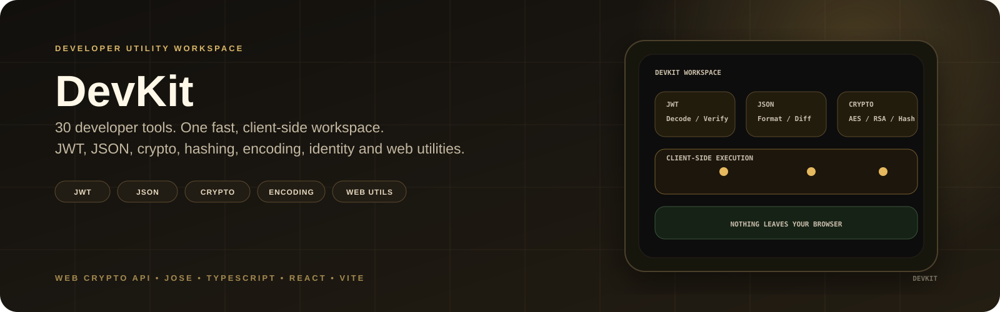
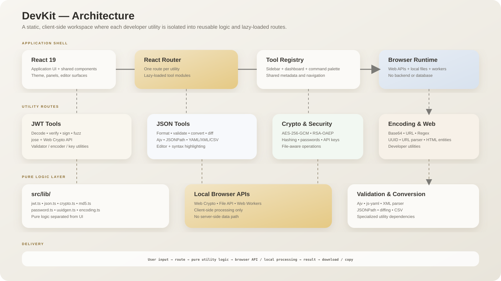
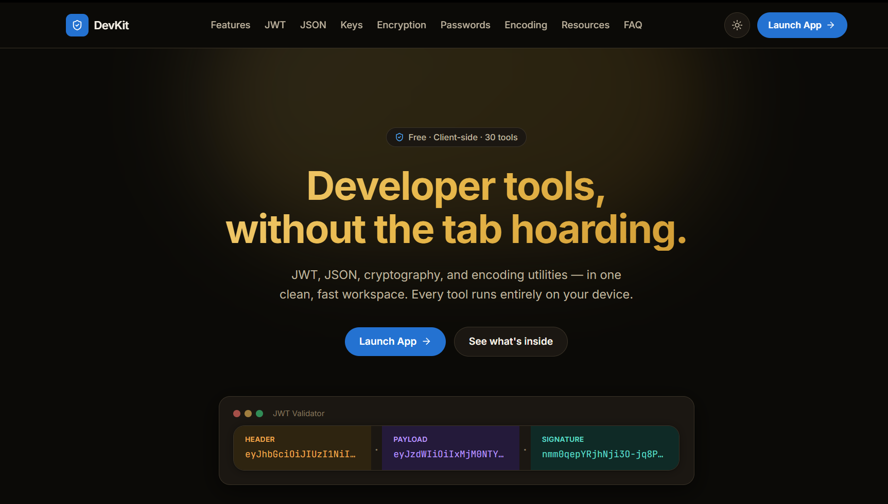
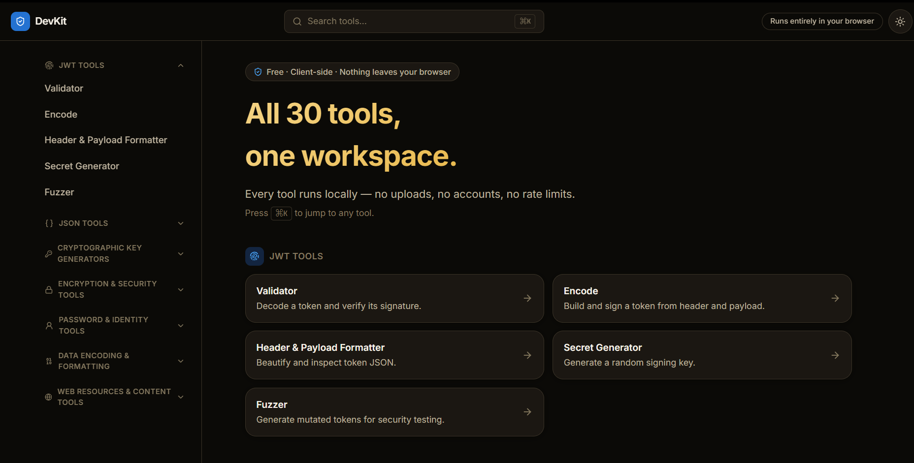
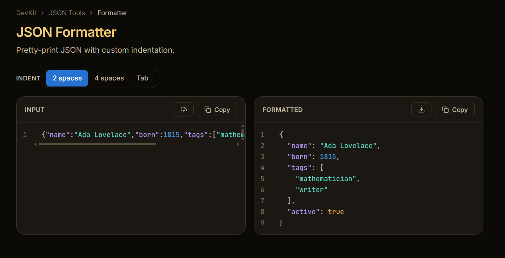

<p align="center">
  
</p>

<div align="center">

# DevKit

**Developer tools, without the tab hoarding.**

30 JWT, JSON, cryptography, encoding, identity, and web utilities in one fast, client-side workspace.

**Nothing you type is sent to a server.**

[Live demo](https://dev-tools-suite-xi.vercel.app/)

</div>

---

## Overview

DevKit brings common developer utilities into a single consistent workspace instead of scattering them across multiple online tools.

The application is **100% client-side**: there is no backend, database, account system, required API key, or analytics pipeline. Cryptographic operations and data transformations run locally in the browser using Web Crypto API and client-side JavaScript.

## Architecture

<p align="center">
  
</p>

### Core flow

```text
User input
    ↓
React route / tool
    ↓
Pure utility logic in src/lib
    ↓
Web APIs / local processing / specialized libraries
    ↓
Result
    ↓
Copy, download, preview, or export
```

## Features

- **30 tools across 7 categories**
- **JWT** decoding, verification, signing, formatting, generation, and fuzzing
- **JSON** formatting, validation, conversion, diffing, JSONPath, schema validation, and editing
- **Cryptography** with AES-256-GCM, RSA-OAEP, hashing, and key generation
- **Encoding** for Base64, URLs, files, and images
- **Developer utilities** for passwords, UUIDs, regex, URLs, and HTML entities
- **File-aware workflows** with local processing and previews
- **Command palette** for fast tool discovery
- **Lazy-loaded routes** so tools are loaded independently
- **Light and dark themes**
- **Download/export** support where useful

## Tools

| Category | Utilities |
|---|---|
| **JWT** | Validator, Encoder, Formatter, Secret Generator, Fuzzer |
| **JSON** | Formatter, Validator, Minifier, Converter, Schema Validator, Path Finder, Diff, Generator, Sort Keys, Escape/Unescape, Tree Editor |
| **Crypto** | RSA/EC Key Pair Generator, AES Key Generator, API Key Generator |
| **Security** | AES-256-GCM, RSA-OAEP, MD5/SHA hashing |
| **Identity** | Password Generator, UUID Generator |
| **Encoding** | Base64, URL Encoder/Decoder, Regex Tester |
| **Web** | Lorem Ipsum, URL Parser, HTML Entities |

## Screenshots

<div align="center">

**Homepage**



<br /><br />

**In-app dashboard**



<br /><br />

**JSON Formatter**



</div>

## Tech Stack

- **React 19 + TypeScript + Vite**
- **React Router** for tool routes and lazy loading
- **Tailwind CSS v4**
- **Web Crypto API** for browser-native cryptography
- **jose** for JWT operations
- **Ajv** for JSON Schema validation
- **js-yaml**, **fast-xml-parser**, **papaparse** for data conversion
- **jsonpath-plus**, **jsondiffpatch**, **uuid** for specialized utilities
- **Vitest + React Testing Library** for testing

## Getting Started

```bash
git clone https://github.com/Zephyrex21/dev-tools-suite.git
cd dev-tools-suite
npm install
npm run dev
```

### Available commands

```bash
npm run dev       # development server
npm run build     # production build
npm run preview   # preview production build
npm run test      # test suite
npm run lint      # linting
```

No environment variables or API keys are required.

## Deployment

DevKit is a static Vite application and can be deployed to any static hosting provider.

- Vercel
- Netlify
- Cloudflare Pages
- GitHub Pages

Build output: `dist/`

## Project Structure

```text
src/
├── components/       Shared UI
├── hooks/             Application hooks
├── lib/               Pure utility logic
├── lib/__tests__/     Logic tests
├── routes/            Tool routes by category
└── App.tsx            Router configuration

.github/workflows/     CI
vercel.json            SPA rewrite configuration
docs/
├── banner.svg
├── architecture.svg
└── development-details.md
```

Each tool follows a simple pattern: **route component + reusable logic module + tool registry entry**.

## Security & Privacy

DevKit is designed around local processing. User-provided text and files are processed in the browser rather than uploaded to an application backend.

For sensitive cryptographic material, users should still verify the implementation and environment before relying on generated output in production systems.

Detailed testing and hardening notes are available in [`docs/development-details.md`](docs/development-details.md).

## License

[MIT](LICENSE)
