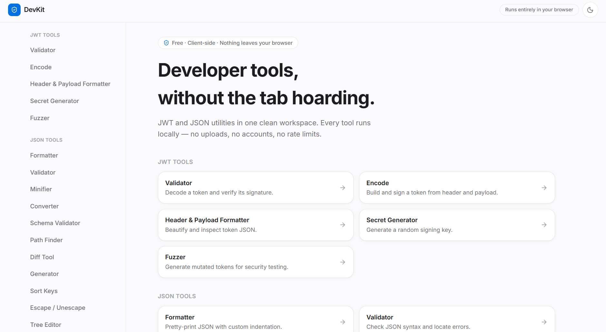

# DevKit

 

A modern browser-based developer toolkit for working with JWT, JSON, and data transformation utilities.

Fast. Private. Client-side. Built for developers.

 

---

  

## Overview

DevKit is an all-in-one developer utility suite designed to simplify common development tasks directly from your browser.

It provides tools for encoding, decoding, validating, formatting, comparing, and transforming data without requiring external services or backend infrastructure.

All processing happens locally in your browser, keeping your data private and secure.

---

## Privacy

DevKit is designed with a privacy-first approach.

Your data stays inside your browser.

No files, tokens, or JSON data are sent to external servers.

---

## Features

<table>
<tr>

<td width="50%" valign="top">

### JWT Tools

* Encode JWT tokens
* Decode JWT payloads
* Validate JWT structure
* Inspect token information

</td>

<td width="50%" valign="top">

### JSON Tools

* JSON formatter and beautifier
* JSON validator
* JSON comparison
* JSONPath query support
* JSON schema validation

</td>

</tr>

<tr>

<td width="50%" valign="top">

### Data Utilities

* JSON ↔ YAML conversion
* JSON ↔ XML conversion
* JSON ↔ CSV conversion

</td>

<td width="50%" valign="top">

### Developer Experience

* Modern responsive interface
* Dark and light themes
* Fast client-side processing
* No account required
* No data uploaded to servers

</td>

</tr>
</table>

---

## Tech Stack

### Frontend

* React
* TypeScript
* Vite
* Tailwind CSS

### Libraries

* jose
* AJV
* JSONPath Plus
* jsondiffpatch
* js-yaml
* fast-xml-parser
* PapaParse

---

## Roadmap

Future improvements:

* More developer utilities
* Improved tool organization
* Keyboard shortcuts
* Advanced JSON utilities
* Progressive Web App support

---

## Contributing

Contributions, suggestions, and improvements are welcome.

Feel free to open an issue or submit a pull request.

---

## License

This project is licensed under the MIT License.
